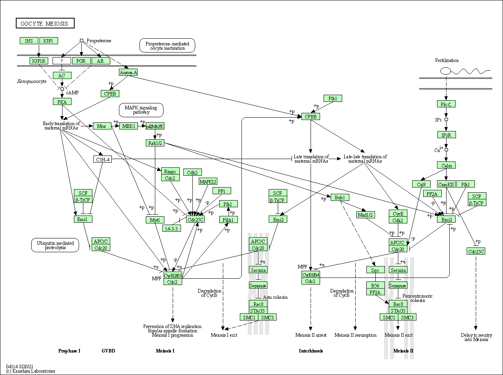

Here we will work on a complete differential expression analysis project. We will use DESeq2 for this.

```{r setup, message = FALSE}
library(DESeq2)
library(ggplot2)
library(AnnotationDbi)
library(org.Hs.eg.db)
```

## 1. Input the counts and metadata files

```{r input}
countData <- read.csv("GSE37704_featurecounts.csv", row.names = 1)
colData <- read.csv("GSE37704_metadata.csv")
```

Inspect these objects.

```{r}
head(colData)
```

```{r}
head(countData)
```

> Q. Complete the code below to remove the troublesome first column from countData.

```{r}
countData <- countData[,-1]
head(countData)
```

> Q. Check on correspondence of colData and countData

```{r}
all(colData$id == colnames(countData))
```

> Q. Complete the code below to filter countData to exclude genes (i.e. rows) where we have 0 read count across all samples (i.e. columns).

```{r}
counts <- countData[ rowSums(countData) != 0, ] 
head(counts)
```

# Run DESeq2 analysis

The steps here are to first setup the object required by DESeq using the `DESeqDataSetFromMatrix()` function. Then, I can run my differential expression with `DESeq()`. 

```{r message=FALSE}
dds = DESeqDataSetFromMatrix(countData=counts,
                             colData=colData,
                             design=~condition)
dds = DESeq(dds)
```

Now get my results out of this dds object.
```{r}
dds
res <- results(dds)
```

## Add annotation 

```{r}
columns(org.Hs.eg.db)
```

> Q. Use the mapIDs() function multiple times to add SYMBOL, ENTREZID and GENENAME annotation to our results by completing the code below.

```{r}
res$symbol <- mapIds(org.Hs.eg.db, 
                    keys=row.names(res), 
                    keytype="ENSEMBL",
                    column="SYMBOL",
                    multiVals="first")

res$entrez <- mapIds(org.Hs.eg.db, 
                    keys=row.names(res), 
                    keytype="ENSEMBL",
                    column="ENTREZID",
                    multiVals="first")

res$genename <- mapIds(org.Hs.eg.db, 
                    keys=row.names(res), 
                    keytype="ENSEMBL",
                    column="GENENAME",
                    multiVals="first")
```
Check my result.

```{r}
head(res)
```


> Q. Finally for this section let's reorder these results by adjusted p-value and save them to a CSV file in your current project directory.

```{r}
# res = res[order(res$pvalue),]
# write.csv(res, file="deseq_results3.csv")
```


# Volcano plot

Common summary figure that gives a nice overview of our result.

```{r}
plot(res$log2FoldChange, -log(res$padj))
```

Try ggplot for this.

```{r}
tmp <- as.data.frame(res)
tmp$fc <- abs(res$log2FoldChange) > 2

ggplot(tmp) + aes(x=log2FoldChange, y= -log(padj), col=fc) + geom_point()
```

> Q. Improve this plot by completing the below code, which adds color and axis labels.

```{r}
# Make a color vector for all genes
mycols <- rep("gray", nrow(res) )

# Color red the genes with absolute fold change above 2
mycols[ abs(res$log2FoldChange) > 2 ] <- "red"

# Color blue those with adjusted p-value less than 0.01 and absolute fold change more than 2
inds <- (res$padj < 0.01) & (abs(res$log2FoldChange) > 2 )
mycols[ inds ] <- "blue"

plot( res$log2FoldChange, -log(res$padj), col= mycols, xlab="Log2(FoldChange)", ylab="-Log(P-value)" )
```

```{r}
# library(EnhancedVolcano)

# x <- as.data.frame(res)

# EnhancedVolcano(x,lab = x$symbol,x = 'log2FoldChange',y = 'pvalue')
```

# Pathway analysis and gene set enrichment

Here we try to bring back the biology and help with the interpretation of our results. We try to answer the question: which pathways and functions feature heavily in our differentially expressed genes. 

```{r}
library(pathview)
```


Recall that we need a "vector of importance" as input for GAGE that has ENTREZ ids set as a name of attribute.

```{r}
foldchange <- res$log2FoldChange
names(foldchange) <- res$entrez
```

```{r}
library(gage)
library(gageData)

data(kegg.sets.hs)
data(sigmet.idx.hs)

# Focus on signaling and metabolic pathways only
kegg.sets.hs = kegg.sets.hs[sigmet.idx.hs]

# Examine the first 3 pathways
head(kegg.sets.hs, 3)
```

Now, let's run the gage pathway analysis.

```{r}
# Get the results
keggres = gage(foldchange, gsets=kegg.sets.hs)
```


Check the attributes of keggres.

```{r}
attributes(keggres)
```

Look at the first 2 down-regulated pathways.
```{r}
# Look at the first few down(less) pathways.
head(keggres$less, 2)
```

Now, let's try out the `pathview()` function from the pathview package to make a pathway plot with our RNA-Seq expression results shown in color.

```{r}
pathview(gene.data=foldchange, pathway.id="hsa04110")
```


> Q. Can you do the same procedure as above to plot the pathview figures for the top 5 down-regulated pathways?

```{r}
# 5 down-regulated pathways
keggrespathways <- rownames(keggres$less)[1:5]

# Extract the 8 character long IDs part of each string
keggresids = substr(keggrespathways, start=1, stop=8)
keggresids
```

```{r}
# View the pathway by passing 5 IDs in keggresids
pathview(gene.data = foldchange, pathway.id = keggresids, species = "hsa")
```





