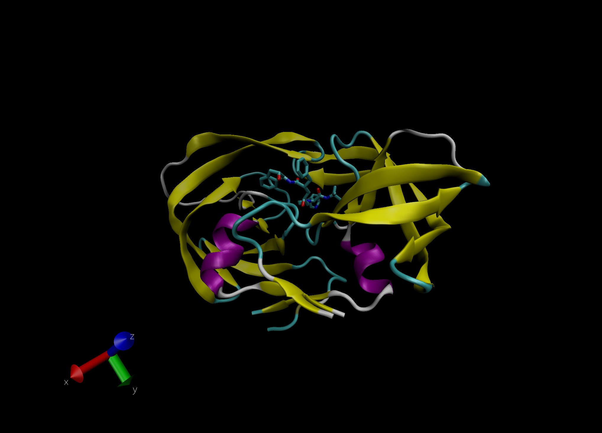
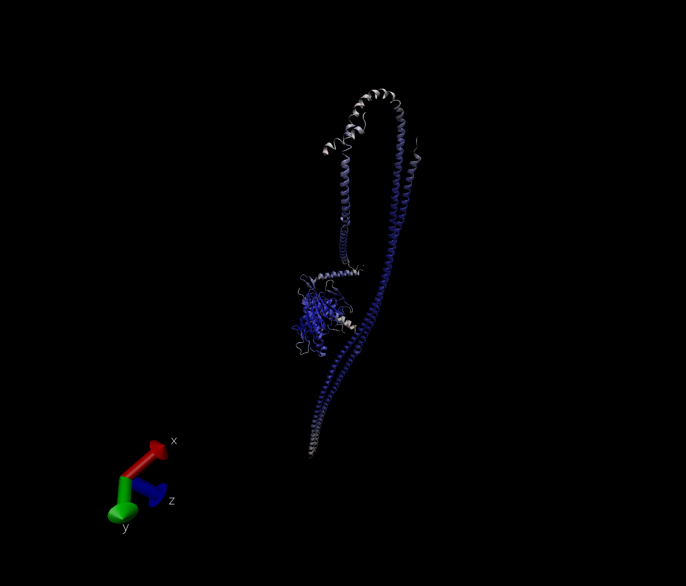

# The PDB database

The PDB is the main repository for 3D structure data of biomolecules.

```{r}
pdb.data <- "Data Export Summary.csv"
pdb.df <- read.csv(pdb.data, row.names = 1)
```

Check the data.

```{r}
head(pdb.df)
```

> Q1: What percentage of structures in the PDB are solved by X-Ray and Electron Microscopy.

```{r}
tot.method <- colSums(pdb.df)
round( tot.method/tot.method["Total"] * 100, 3)
```

87.197% of structures in the PDB are solved by X-Ray and and 5.354% by Electron Microscopy.

> Q2: What proportion of structures in the PDB are protein?

```{r}
ans <- pdb.df$Total[1] / sum(pdb.df$Total) * 100
round(ans, 3)
```

`r round(ans, 3)` of structures in the PDB are proteins.

> Q3: Type HIV in the PDB website search box on the home page and determine how many HIV-1 protease structures are in the current PDB?

There are 1893 HIV-1 protease structures in the current PDB.

Here is a VMD generated image of HIV-protease, PDB code: 1hsg



> Q4: Water molecules normally have 3 atoms. Why do we see just one atom per water molecule in this structure?

We just see one atom per water molecule when there are 3 atoms for water molecule because one atom represents the residue. Water has a residue of HOH so only one atom shows on VMD.


> Q5: There is a conserved water molecule in the binding site. Can you identify this water molecule? What residue number does this water molecule have (see note below)?

Residue 308 is a conserved water molecule in the binding site.


## Bio3D package for structural bioinformatics

We will load the bio3d package.

```{r}
library(bio3d)

pdb <- read.pdb("1hsg")
pdb
```

> Q6: As you have hopefully observed HIV protease is a homodimer (i.e. it is composed of two identical chains). With the aid of the graphic display and the sequence viewer extension can you identify secondary structure elements that are likely to only form in the dimer rather than the monomer?

Yes, 2 beta sheets from chain A and 1 beta sheets from chain B are likely to only form in the dimer rather than the monomer.


> Q7: How many amino acid residues are there in this pdb object?

There are 198 amino acid residues.


> Q8: Name one of the two non-protein residues?

One of the two non-protein residues is MK1.


> Q9: How many protein chains are in this structure?

There are two protein chains in this structure.


```{r}
head( pdb$atom )
```

> Q10. Which of the packages above is found only on BioConductor and not CRAN?

The msa pacakage is found only on BioConductor and not CRAN.


> Q11. Which of the above packages is not found on BioConductor or CRAN?

The bio3d-view package is not found either on BioConductor or CRAN.


> Q12. True or False? Functions from the devtools package can be used to install packages from GitHub and BitBucket?

TRUE


Extract the sequence for ADK
```{r}
aa <- get.seq("1ake_A")
aa
```

```{r}
# use blast to find similar sequences
blast <- blast.pdb(aa)
```

```{r}
# hits have the good results
hits <- plot(blast)
```

```{r}
hits$pdb.id
```

## Normal mode analysis (NMA)

```{r}
pdb <- read.pdb("1ake")
pdb
```

There are 2 chains (A and B). Trim to chain A only.

```{r}
chain <- trim.pdb(pdb, chain="A")
chain
```

> Q13. How many amino acids are in this sequence, i.e. how long is this sequence? 

There are 214 amino acids in this sequence.


Run a bioinformatics method to predict the flexibility and "functional motions" of this protein chain.
```{r}
modes <- nma(chain)
```

```{r}
plot(modes)
```

```{r}
m7 <- mktrj.nma(modes, mode=7, file="mode_7.pdb")
```




> Q14. What do you note about this plot? Are the black and colored lines similar or different? Where do you think they differ most and why?

The plot shows the fluctuation of amino acid for 16 sequences. The black and colored lines are different especially in residue number from approximately 125 to 150. In this region, the amino acid of colored lines are likely to fluctuate and change to a different amino acid and eventually have a different folding than that of black lines.