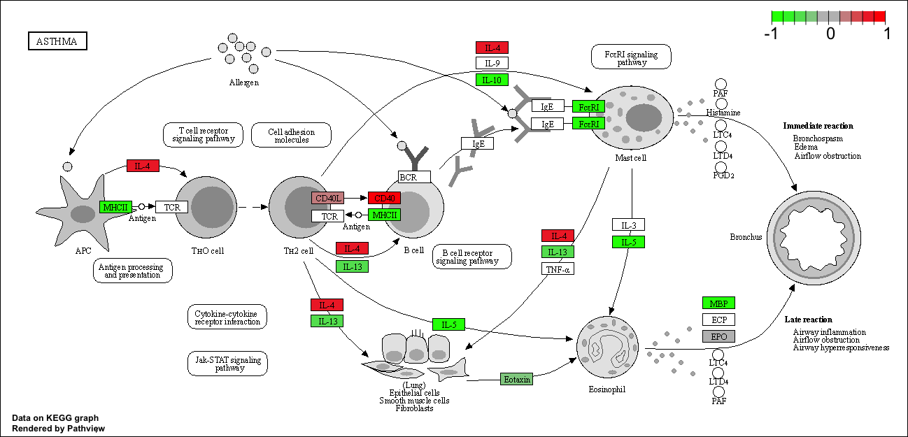
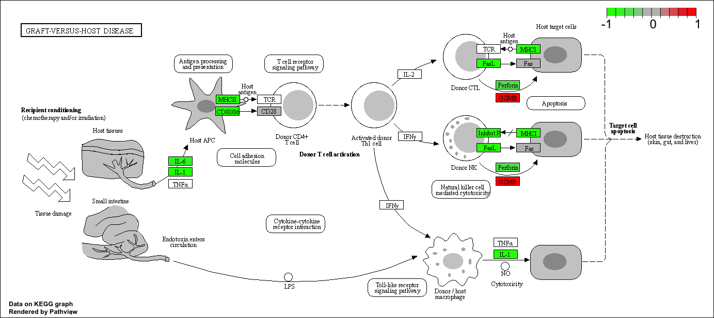
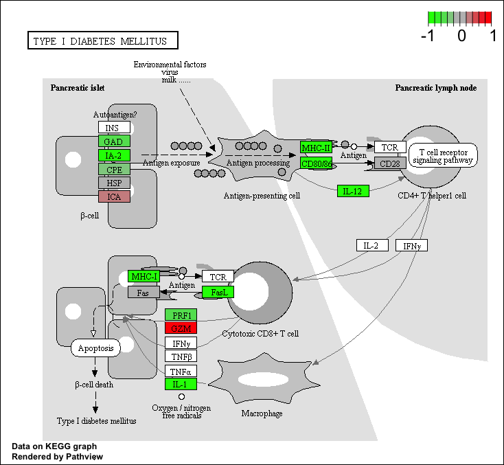

This week we are looking at differential expression analysis. 

The data for this hands-on session comes from a published RNA-seq experiment where airway smooth muscle cells were treated with dexamethasone, a synthetic glucocorticoid steroid with anti-inflammatory effects (Himes et al. 2014).

## Import/Read the data from Himes et al. 

```{r}
counts <- read.csv("airway_scaledcounts.csv", row.names=1)
metadata <-  read.csv("airway_metadata.csv")
```


Lets have a peak at this data
```{r}
head(metadata)
```

Sanity check on correspondence of counts and metadata

```{r}
all( metadata$id == colnames(counts) )
```


```{r}
dim(counts)
```

> Q1. How many genes are in this dataset? 

There are `r nrow(counts)` genes in this dataset.


```{r}
n.control <- sum( metadata$dex == "control" )
```

> Q2. How many ‘control’ cell lines do we have?

There are `r n.control` 'control' cell lines.

```{r}
table(metadata$dex == "control")
```

### Extract and summarize the control samples

To find out where the control samples are we need the metadata

> Q3. How would you make the above code in either approach more robust?

```{r}
control <- metadata[ metadata$dex == "control", ]
control.counts <- counts[ , control$id ] 
control.mean <- rowMeans(control.counts)
head(control.mean)
```

Use rowMeans() instead of rowSums()/4.


### Extract and summarize the treated samples

> Q4. Follow the same procedure for the treated samples (i.e. calculate the mean per gene across drug treated samples and assign to a labeled vector called treated.mean)

```{r}
treated <- metadata[ metadata$dex == "treated", ]
treated.count <- counts[ , treated$id ] 
treated.mean <- rowMeans(treated.count)
head(treated.mean)
```


Store these results together in a new data frame called `meancounts`. 

```{r}
meancounts <- data.frame(control.mean, treated.mean)
```


Lets make a plot to explore the results

> Q5 (a). Create a scatter plot showing the mean of the treated samples against the mean of the control samples. Your plot should look something like the following.

```{r}
plot(meancounts[,1], meancounts[,2], xlab="Control", ylab="Treated")
```

>Q5 (b).You could also use the ggplot2 package to make this figure producing the plot below. What geom_?() function would you use for this plot?

```{r}
library("ggplot2")
ggplot(meancounts) + aes(x=control.mean, y=treated.mean) + geom_point(alpha=0.3) + labs(x="Control", y="Treated")
```

We will make a log-log plot to draw out this skewed data and see what is going on. 


> Q6. Try plotting both axes on a log scale. What is the argument to plot() that allows you to do this?

```{r}
plot(meancounts[,1], meancounts[,2], log="xy", xlab="log control counts", ylab="log of treated counts")
```

We often log2 transformations when dealing with this sort of data.

```{r}
log2(20/20)
log2(40/20)
log2(20/40)
log2(80/20)
```

This log2 transformation has this nice property where if there is no change the log2 value will be zero and if it double the log2 value will be 1 and if halved it will be -1. 

If the drug had no effect, the log of treated.mean vs. control.mean would just have a straight line. However, the log2 fold change have some up and down from 0, which indicates the possibility that the drug have an effect. 

So lets add a log2 fold change column to our results.

```{r}
# add a column
meancounts$log2fc <- log2(meancounts$treated.mean / meancounts$control.mean)
```

```{r}
head(meancounts)
```


We need to get rid of zero count genes that we can not say anything about.

```{r}
zero.values <- which( meancounts[ , 1:2] == 0, arr.ind=TRUE ) 
to.rm <- unique( zero.values[ , 1] )
mycounts <- meancounts[-to.rm, ]
```

```{r}
head(mycounts)
```

> Q7. What is the purpose of the arr.ind argument in the which() function call above? Why would we then take the first column of the output and need to call the unique() function?

which() tells us which elements are true in the vector. The arr.ind=TRUE argument will tell which() to return both row and columns that have a TRUE value. unique() will prevent us from counting the zero twice from both column 1 and 2. 


How many genes are remaining?

```{r}
nrow(mycounts)
```

> Q8. Using the up.ind vector above can you determine how many up regulated genes we have at the greater than 2 fc level? 

```{r}
up.ind <- mycounts$log2fc > 2
sum(up.ind)
```

There are 250 up-regulated genes that have greater fold change than 2. 


> Q9. Using the down.ind vector above can you determine how many down regulated genes we have at the greater than 2 fc level? 

```{r}
down.ind <- mycounts$log2fc < (-2)
sum(down.ind)
```
There are 367 down-regulated genes with fold changes smaller than -2. 


> Q10. Do you trust these results? Why or why not?

No, not yet. We do not know whether the change is statistically significant. 


# DESeq2 Analysis

Let's do this the right way. DEseq2 is an R package specifically for analyzing count-based NGS data like RNA-seq. 

```{r}
# load up DESeq2
library(DESeq2)

dds <- DESeqDataSetFromMatrix(countData=counts, 
                              colData=metadata, 
                              design=~dex)
dds
```

```{r}
dds <-  DESeq(dds)
```

```{r}
res <- results(dds)
res
```

We can get some basic summary tallies using the `summary()` function.

```{r}
summary(res, alpha=0.05)
```

# Volcano plot

Make a summary plot of our results. 

```{r}
plot( res$log2FoldChange, -log(res$padj) )
```

```{r}
log(0.1)
log(0.005)
```

Finish for today by saving our results

```{r}
write.csv(res, file="DESeq2_results.csv")
```


---

# Adding annotation data

To help interpret our results, we need to understand what the differentially expressed genes are. A first step here is to get the gene names (i.e. gene SYMBOLS).

For this I will install:
- BiocManager::install("AnnotationDbi") 
- BiocManager::install("org.Hs.eg.db")

```{r}
# BiocManager main annotation packages
library("AnnotationDbi")
library("org.Hs.eg.db")
```

What DB identifiers can I look up? 

```{r}
# There should be some similar data bases
columns(org.Hs.eg.db)
```

We will use `mapIds()` function to translate between different ids.

```{r}
res$symbol <- mapIds(org.Hs.eg.db,
                keys=row.names(res), # Our genenames
                keytype="ENSEMBL",   # The format of our genenames
                column="SYMBOL",     # The new format we want to add
                multiVals="first")
```

```{r}
head(res)
```

> Q11. Run the mapIds() function two more times to add the Entrez ID and UniProt accession and GENENAME as new columns called res$entrez, res$uniprot and res$genename.

```{r}
# entrez : NCBI database
res$entrez <- mapIds(org.Hs.eg.db,
                keys=row.names(res), # Our genenames
                keytype="ENSEMBL",   # The format of our genenames
                column="ENTREZID",     # The new format we want to add
                multiVals="first")

```

```{r}
res$uniprot <- mapIds(org.Hs.eg.db,
                keys=row.names(res), # Our genenames
                keytype="ENSEMBL",   # The format of our genenames
                column="UNIPROT",     # The new format we want to add
                multiVals="first")
```

```{r}
res$genename <- mapIds(org.Hs.eg.db,
                keys=row.names(res), # Our genenames
                keytype="ENSEMBL",   # The format of our genenames
                column="GENENAME",     # The new format we want to add
                multiVals="first")
```

```{r}
head(res)
```

# Pathway analysis with R and Bioconductor

Here we play with just one, the GAGE package (which stands for Generally Applicable Gene set Enrichment), to do KEGG pathway enrichment analysis on our RNA-seq based differential expression results.

I need to install the gage package along with the pathview package for generating pathway figures from my results. 

- BiocManager::install( c("pathview", "gage", "gageData") )

```{r}
library(pathview)
library(gage)
library(gageData)

data(kegg.sets.hs)

# Examine the first 2 pathways in this kegg set for humans
head(kegg.sets.hs, 2)
```

We need a vector of fold-change labeled with the names of our genes in ENTREZ format.
```{r}
# Make a separate vector for res$log2FoldChange
foldchanges = res$log2FoldChange

# Assign "literally" names to this vector that we can identify the foldchanges with entrez format
names(foldchanges) = res$entrez
head(foldchanges)
```

Now we can run the GAGE analysis passing in our foldchanges vector and the KEGG genesets we are interested in.

```{r}
# Get the results
keggres = gage(foldchanges, gsets=kegg.sets.hs)
```

Let's have a look at what is contained in this `keggres` results object (i.e. it's attributes).

```{r}
attributes(keggres)
```

```{r}
# Look at the first three down (less) pathways
head(keggres$less, 3)
```

```{r}
pathview(gene.data=foldchanges, pathway.id="hsa05310")
```



> Q12. Can you do the same procedure as above to plot the pathview figures for the top 2 down-reguled pathways?

```{r}
pathview(gene.data=foldchanges, pathway.id="hsa05332")
pathview(gene.data=foldchanges, pathway.id="hsa04940")
```




## Final step save our results

```{r}
write.csv(res, file="deseq_results2.csv")
```

